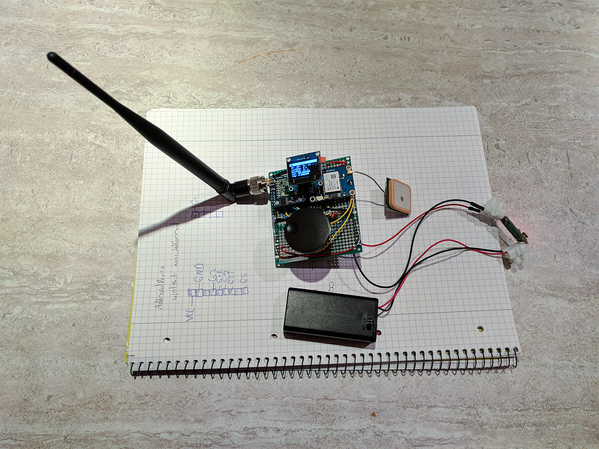
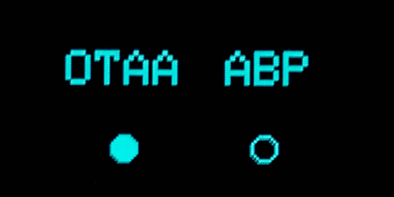
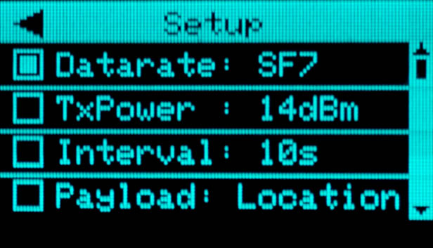
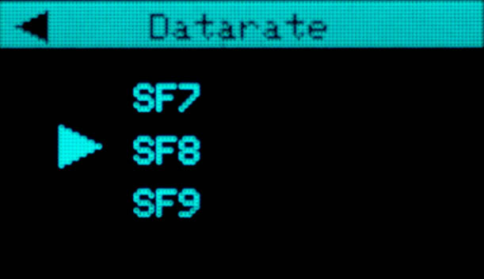
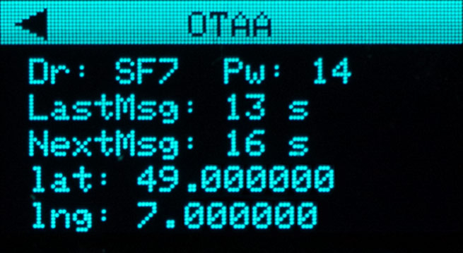

# LoRaWanTracker
GPS tracker which transmits its location via LoRaWan to the [The Things Network (TTN)](https://www.thethingsnetwork.org/).

  
  
<em>The current setup of the LoRaWanTracker</em>

The LoRaWanTracker was created to ease the process of range testing as it allows to set transmit parameters like the data rate or interval during runtime. A small OLED display is used to draw the UI and thanks to the rotary encoder a user can interact with it. 

## Table of contents
<!-- toc -->
- [Setup](#setup)
   * [Hardware](#hardware)
   * [Software](#software)
- [Usage](#usage)
- [Suggestions](#suggestions)
<!-- tocstop -->

## Setup

### Hardware

|Component name                                                   | Source                                                                                                                         |
|:----------------------------------------------------------------|--------------------------------------------------------------------------------------------------------------------------------|
|ESP32 Development Board                                          |[Amazon.de](https://www.amazon.de/AZDelivery-NodeMCU-Development-Nachfolgermodell-ESP8266/dp/B071P98VTG/)                       |
|Adafruit RFM95W LoRa Radio Transceiver Breakout - 868 or 915 MHz |[Exp-tech.de](https://www.exp-tech.de/module/wireless/funk/7310/adafruit-rfm95w-lora-radio-transceiver-breakout-868-or-915-mhz) |
|868 MHz Antenna                                                  |[Amazon.de](https://www.amazon.de/gp/product/B06Y1RNFBT/)                                                                       |
|NEO-6M GPS Modul                                                 |[Amazon.de](https://www.amazon.de/AZDelivery-NEO-6M-GPS-baugleich-u-blox/dp/B01N38EMBF/)                                        |
|0,96" I²C 128x64 Pixel OLED Display                              |[Amazon.de](https://www.amazon.de/AZDelivery-Display-Arduino-Raspberry-gratis/dp/B01L9GC470/)                                   |
|KY-040 Rotary Encoder                                            |[Amazon.de](https://www.amazon.de/gp/product/B01G1EWAAG/)                                                                       |
|Battery Holder 2*AA                                              |[Exp-tech.de](https://www.exp-tech.de/zubehoer/batterien-akkus/batteriehalter/7871/batteriehalter-2x-aa-mit-schalter)           |
|Step-Up Voltage Converter 1-5V to 5V                             |[Amazon.de](https://www.amazon.de/Boost-Converter-DC-DC-Step-Up-Arduino/dp/B01MSWNF05/)                                         |

Connecting the hardware to the ESP32 board is straightforward because it offers all necessary interfaces and every component is compatible with the 3.3V voltage level. The modules are connected to the microcontroller as shown in the table below.

####  Pinout
<table>
  <tr>
    <th align="center">Module</th>
    <th align="center" colspan="2">ESP32</th>
    <th align="center">Module</th>
  </tr>
  <tr>
    <td align="center">3.3V (A)</td>
    <td align="center">3.3V</td>
    <td align="center">GND</td>
    <td align="center">GND (A)</td>
  </tr>
  <tr>
    <td align="center"></td>
    <td align="center">EN</td>
    <td align="center">GPIO23 MOSI</td>
    <td align="center">MOSI (L)</td>
  </tr>
  <tr>
    <td align="center"></td>
    <td align="center">GPIO36</td>
    <td align="center">GPIO22 SCL</td>
    <td align="center">SCL (D)</td>
  </tr>
  <tr>
    <td align="center"></td>
    <td align="center">GPIO39</td>
    <td align="center">GPIO1 TX0</td>
    <td align="center"></td>
  </tr>
  <tr>
    <td align="center"></td>
    <td align="center">GPIO34</td>
    <td align="center">GPIO3 RX0</td>
    <td align="center"></td>
  </tr>
  <tr>
    <td align="center"></td>
    <td align="center">GPIO35</td>
    <td align="center">GPIO21 SDA</td>
    <td align="center">SDA (D)</td>
  </tr>
  <tr>
    <td align="center"></td>
    <td align="center">GPIO32</td>
    <td align="center">GND</td>
    <td align="center"></td>
  </tr>
  <tr>
    <td align="center">CLK (R)</td>
    <td align="center">GPIO33</td>
    <td align="center">GPIO19 MISO</td>
    <td align="center">MISO (L)</td>
  </tr>
  <tr>
    <td align="center">DT (R)</td>
    <td align="center">GPIO25</td>
    <td align="center">GPIO18 SCK</td>
    <td align="center">SCK (L)</td>
  </tr>
  <tr>
    <td align="center">SW (R)</td>
    <td align="center">GPIO26</td>
    <td align="center">GPIO5 SS</td>
    <td align="center">RST (L)</td>
  </tr>
  <tr>
    <td align="center"></td>
    <td align="center">GPIO27</td>
    <td align="center">GPIO17</td>
    <td align="center">RX (G)</td>
  </tr>
  <tr>
    <td align="center"></td>
    <td align="center">GPIO14</td>
    <td align="center">GPIO16</td>
    <td align="center">TX (G)</td>
  </tr>
  <tr>
    <td align="center"></td>
    <td align="center">GPIO12</td>
    <td align="center">GPIO4</td>
    <td align="center"></td>
  </tr>
  <tr>
    <td align="center">Power source -</td>
    <td align="center">GND</td>
    <td align="center">GPIO0</td>
    <td align="center"></td>
  </tr>
  <tr>
    <td align="center"></td>
    <td align="center">GPIO13</td>
    <td align="center">GPIO2</td>
    <td align="center">G0 (L)</td>
  </tr>
  <tr>
    <td align="center"></td>
    <td align="center">GPIO9</td>
    <td align="center">GPIO15</td>
    <td align="center">G1 (L)</td>
  </tr>
  <tr>
    <td align="center"></td>
    <td align="center">GPIO10</td>
    <td align="center">GPIO8</td>
    <td align="center"></td>
  </tr>
  <tr>
    <td align="center"></td>
    <td align="center">GPIO11</td>
    <td align="center">GPIO7</td>
    <td align="center"></td>
  </tr>
  <tr>
    <td align="center">Power source +</td>
    <td align="center">5V</td>
    <td align="center">GPIO6</td>
    <td align="center"></td>
  </tr>
</table>

##### Abbreviations:
<table>
  <tr>
    <td>A</td>
    <td>All modules</td>
  </tr>
  <tr>
    <td>D</td>
    <td>Display</td>
  </tr>
  <tr>
    <td>G</td>
    <td>GPS module</td>
  </tr>
  <tr>
    <td>L</td>
    <td>LoRa transceiver</td>
  </tr>
   <tr>
    <td>R</td>
    <td>Rotary encoder</td>
  </tr>
</table>

### Software
The Arduino software makes use of the [Arduino core for ESP32 project](https://github.com/espressif/arduino-esp32) and numerous libraries listed below. I use [Visual Studio Code](https://code.visualstudio.com/) with the [PlatformIO plugin](http://docs.platformio.org/en/latest/ide/vscode.html) to maintain the project.

If you want to set up the project on your own computer, you can follow these steps:
- ([Install Visual Studio Code and the PlatformIO plugin](http://docs.platformio.org/en/latest/ide/vscode.html))
- Install the [Espressif 32 Platform](https://github.com/platformio/platform-espressif32).
- Clone or download this repository into your working directory.
- Download the required libraries through the library manager of PlatformIO or download and unzip them into the lib folder on your own.
- Uncomment `#define SSD1306_128_64` in [Adafruit_SSD1306.h#73](https://github.com/adafruit/Adafruit_SSD1306/blob/ddfec78fa15f0ff8dfc8a76524077ba6bb5fc6f3/Adafruit_SSD1306.h#L73) and comment out the line below. That way the appropriate display resolution is set.

#### Required libraries
|Library name                             | Source                                                          |
|:----------------------------------------|:----------------------------------------------------------------|
|Adafruit-GFX-Library                     |<https://github.com/adafruit/Adafruit-GFX-Library>               |
|Adafruit_SSD1306                         |<https://github.com/adafruit/Adafruit_SSD1306>                   |
|TinyGPSPlus                              |<https://github.com/mikalhart/TinyGPSPlus>                       |
|Arduino-LMIC library (slightly modified) |<https://github.com/JulianSchroden/arduino-lmic/tree/testing>    |
|activity-runtime-for-arduino             |<https://github.com/JulianSchroden/activity-runtime-for-arduino> |

#### Device registration
Visit the TTN console, add a new application to your account and register a new device. Now you can replace the credentials in [src/loraConfig.h](src/loraConfig.h) with your keys. Afterwards, you only need to build and upload the code to your ESP32 and you are ready to go.

## Usage
After powering up the LoRaWanTracker, the main screen is started. Turn the rotary encoder to choose, whether you want to use OTAA (Over The Air Activation), or ABP (Activation by Personalization) to register your device.  

  

When you press the integrated pushbutton the mode is selected, and the setup screen is displayed, which shows the transmission settings as a scrollable list.

  

Scroll through the entries by turning the encoder and push the button to select the attribute you want to modify. A screen is started as a result which lets you pick the attribute's value.

  

After you have selected the desired value, you can go back to the setup screen by pressing the button for 1 second. 
Navigate to the "start" entry at the bottom of the setup screen when you are happy with the device settings and push the button once again to start the location transmission screen.

  

If you have chosen the OTAA mode, the tracker will try to join the network at first. Afterwards, the display shows the current location and transmission parameters alongside the seconds since the last and till the next message.
From now on the tracker will transmit its location continuously until you return to the upper screen (hold button for 1 second) or it is powered off.

## Suggestions
The LoRaWanTracker could be improved by:
- Adding a larger screen
- Replacing the non-rechargeable battery with a rechargeable one
- Adding a 3D printed housing
